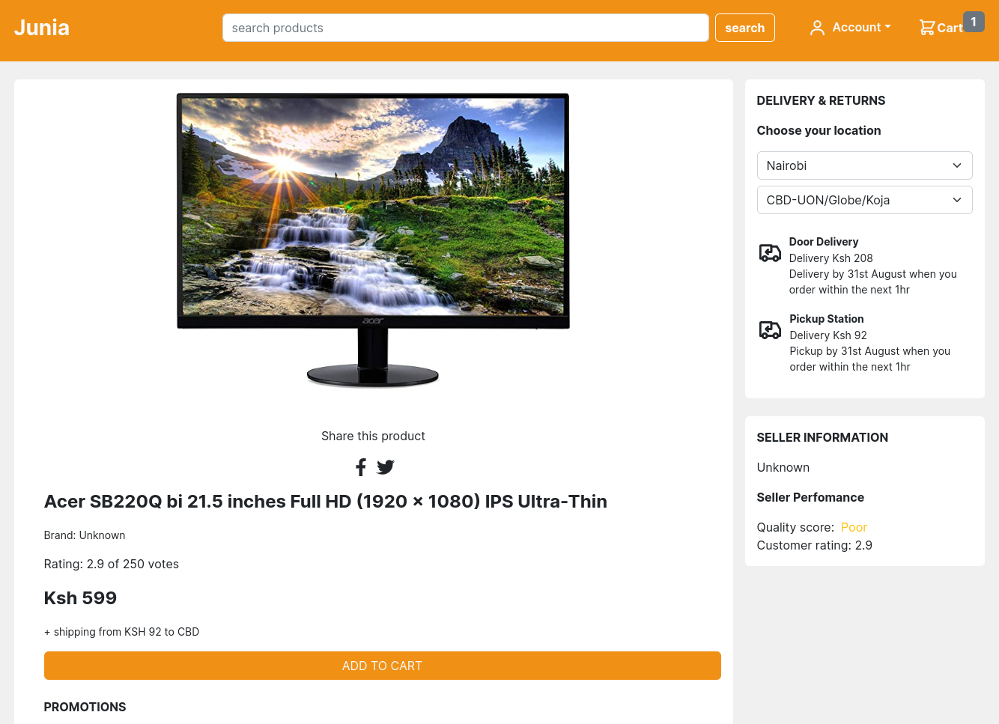
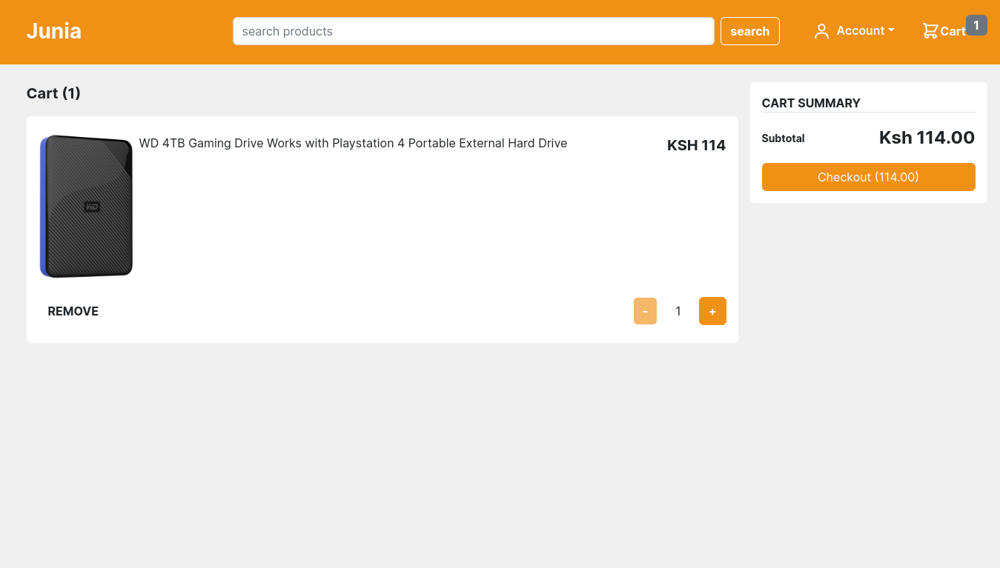
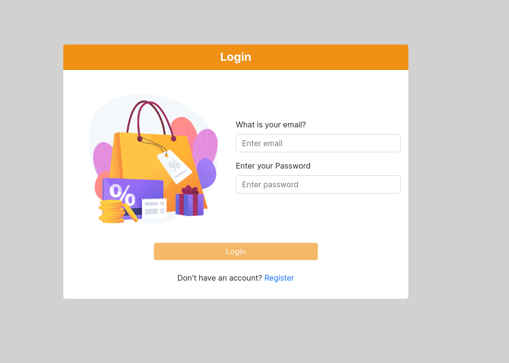

# JUNIA
Junia is an eccomerce web app built on the MERN stack i.e. M - MongoDB, E - Express.js, R - React.js, N - Node.js. Users can view products available for sale, see the description and prices, add the product to cart, enter shipping address, choose payment method and then place the order. However certaing actions like entering the shipping address, payment and plaing orders is only allowed for logged in users. Authentication and Authorization use JSON web tokens which are generated in the backend and are provided when a user enters valid credentials in the login page.


## Getting Started

- Type the following command in your terminal to clone this repository

```
https://github.com/Edu58/Junia-Eccomerce.git
```

If you are using SSH, use the following command

```
git@github.com:Edu58/Junia-Eccomerce.git
```

When you run the commands successfully, you should have a local version of this repository.

### Prerequisites

- A computer with Node installed
- Access to the Internet
- An IDE of your choice e.g. VS Code, Sublime Text or Atom

### Installing

Before starting the application, navigate into the frontend and backend folders and run ```nmp install``` to install the project dependencies.

create .env file in the backend project root directory and populate it with:
```
DATABASE_CONNECTION_URI='<your mongodb uri>'
ACCESS_TOKEN_SECRET='<your access token secret>'
REFRESH_TOKEN_SECRET='<your refresh token secret>'
```

To run the web app, navigate inside the frontend folder and
run ```npm run dev``` to start the local server then navigate into the backend folder and run ```npm start``` in your terminal. Both servers should be running for the web app to work.
 Once the server is running, open your browser and enter localhost:5173 or the address shown in the terminal running the frontend local server.
Open your
preferred browser, and enter the address in your url bar and press enter and you should be able to use the app now. This will only work on the computer running the server. It
is not available to anyone else.

## More screenshots




## Built With

* [Node.js](https://nodejs.org/en/)
* [Express.js](https://expressjs.com/) - Web framework used in the backend with Node.js
* [React.js](https://reactjs.org/) - Frontend Library to create the UI
* [MongoDB](https://www.mongodb.com/) - Database used (NoSQL)

## Known Bugs
Missing payments. working on it.

Feel free to submit a pull request or reach out at edumuriithi58@gmail.com.

## Contributing

Feel free to submit a pull request or reach out at edumuriithi58@gmail.com.

## Authors

* **Edwin Karimi** - *Initial work* - [Junia-Eccomerce](https://github.com/Edu58/Junia-Eccomerce)

- Twitter - [@GISDevEd](https://twitter.com/GISDevEd)
- Linkedin - [edwin-karimi](https://www.linkedin.com/in/edwin-karimi/)
  <br>
  <br>
- No contributors yet

## License

This project is licensed under the MIT License - see the [LICENSE.md](LICENSE) file for details